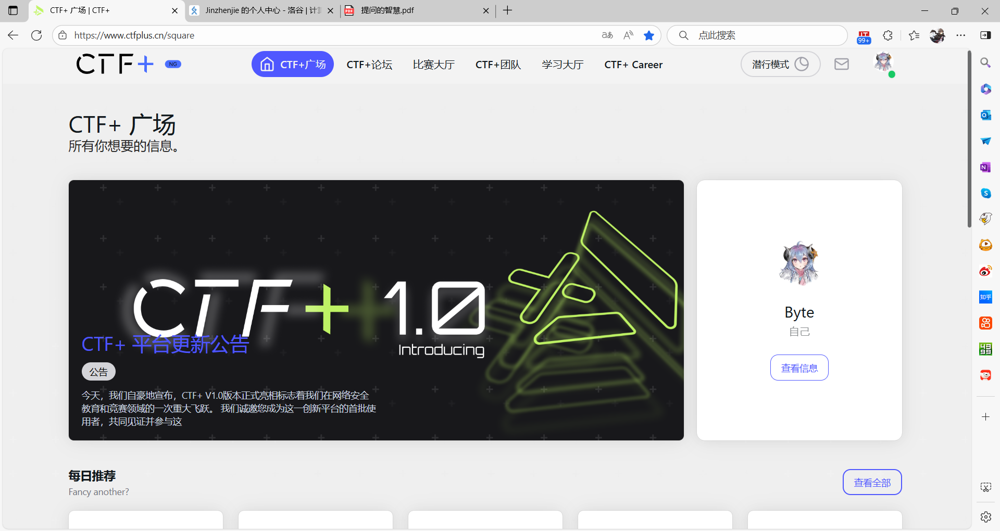
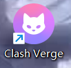

在为期3天的学习中，我一次学习了以下内容，以下为我的学习报告

# 任务1：CTF+ 平台注册

我按照Task 0 中的要求，已完成CTF+的注册
如下图：

  

—————————————————

# 任务二：电子扫盲

没啥好弄的，熟练掌握计算机的基本操作  

—————————————————

# 任务三：学习记笔记

已经学会如何使用markdown记笔记

——————————————————

# 任务四：学会使用代理

高中时就会用了，没啥好说的  

  

——————————————————

# 任务五：初步了解什么是编程

在初中、高中对C、C++、python、HTML进行过初步的了解，并可以使用C++和python进行一些中低难度的算法题编程 

————————————————————
# 任务六：学会使用LLM

平常会使用豆包、deepseek、chatgpt等进行编程学习方面的辅助 

# 任务七：一些知名网站

平常会在CSDN、GitHub等网站寻找资源并进行学习

# 任务八：学习问问题

已经阅读完《提问的智慧》
