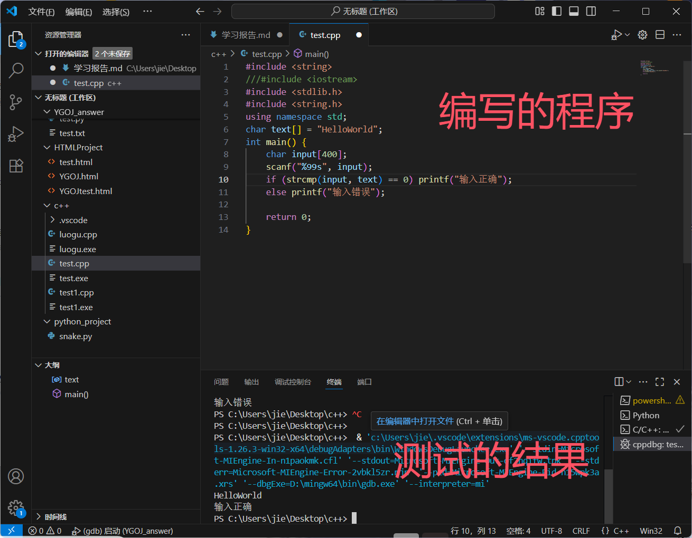

姓名：金振杰
QQ号：2162641503
在为期2天的学习中，我一次学习了以下内容，以下为我的学习报告

# 任务1：C语言基础任务
* 对C语言进行了一定程度上的学习  
因为有C++基础，所以我对基本数据类型、流程控制、函数的使用与定义、基本输入输出有一定程度上的了解 

* 我使用VScode，配置文件使用高中时已经配置完成的C++文件  

* 我按照要求编写了一段C语言代码

* 使用IDA对上述exe文件进行了逆向操作首先打开exe文件发现要求我们输入文本 

* 接着打开IDA，在string中搜索相应值 

* 从而求得该exe文件的main函数 

* 由strcmp函数得要求得input值为text存储的值，从而逆向求得要求的text值为HelloWorld 

—————————————————

# 任务二：工具入门

* 我使用CyberChef将一段base64密码成功解码
* 使用DIE对一个exe文件进行识别，发现其加了壳且壳的类型为UPX 

—————————————————

# 任务三：虚拟机 &Linux的安装

使用VMware安装了Kali，并进行了相关命令的操作

——————————————————

# 任务四：b斩wmx训练一

已观看完该部分的视频