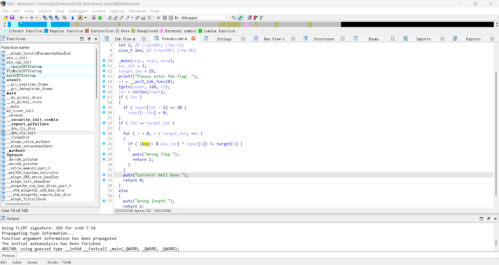

姓名：金振杰
QQ号：2162641503
在为期3天的学习中，我一次学习了以下内容，以下为我的学习报告

# 任务1：C语言基础任务
```c
#include <stdio.h>
#include <stdlib.h>
#include <string.h>

int main(void) {
   char buf[256];
   for(int i = 0; i<sizeof(buf);i++)
    {
      buf[i] = i+1;
    }  
    char * p1 = buf;
    int * p2 = (int *)buf;
    long * p3  = (long *)buf;
    printf("the value of diffrent ptr is %p, %p, %p \n",*(p1+1),*(p2+1),*(p3+1));
    return 0;
}
```
在该段代码中输出为`the value of diffrent ptr is 0x2, 0x8070605, 0x100f0e0d0c0b0a09 `
1. 其中
```c
char buf[256];
   for(int i = 0; i<sizeof(buf);i++)
    {
      buf[i] = i+1;
    }  
```
该部分代码定义了一个类型为char的数组，其值分别从1到256
2. `char * p1 = buf;`该部分代码定义了一个名叫`p1`的指针，其字节大小为`1 Byte`  
   `int * p2 = (int *)buf;`该部分代码定义了一个名叫`p2`大小为`4 Byte`的指针将buf的指针类型重置为`int`类型，即指针大小变成了`4 Byte`  
   `long * p3  = (long *)buf;`同理可得，该段代码作用为定义一个类型为`long`的指针`p3`，其大小为`8 Byte`
3. 
   ```c
   printf("the value of diffrent ptr is %p, %p, %p \n",*(p1+1),*(p2+1),*(p3+1));
   ```
   该段代码中要求输出`*(p1+1)` `*(p2+1)` `*(p3+1)` ,这三者分别代表`bur[0]` `bur[4]~bur[7]` `bur[8]~bur[15]`,故答案为`the value of diffrent ptr is 0x2, 0x8070605, 0x100f0e0d0c0b0a09`
   ——————————————————————————————
```c
#include <stdio.h>
#include <stdlib.h>
#include <string.h>

typedef struct two two_t;

typedef struct one {
    size_t a;
    two_t *two;    
} one_t;

struct two {
    size_t b;
    size_t s;
};

int main(void) {
    char a[16];
    one_t one;
    one.a = 0x200;
    one.two = (two_t *)a;
    one.two->b = 0x100;
    one.two->s = 0xdeadbeef;
    
    size_t * p = (size_t *)(((char*)(*((size_t *)(((char*)&one)+8))))+8);
    printf("指针运算: s = %p\n",*p);
    
    return 0;
}
```
该段代码输出结果为`0xdeadbeef`
1. 其中
```c
typedef struct two two_t;

typedef struct one {
    size_t a;
    two_t *two;    
} one_t;

struct two {
    size_t b;
    size_t s;
};
```
该段代码中的`typedef struct two two_t;`对结构体`two`取了个别名`two_t`
```c
typedef struct one {
    size_t a;
    two_t *two;    
} one_t;
```
该段代码建立了一个结构体`one`，并给他取了个别名`one_t`,其中的两个变量分别为`a`和结构体`two`
```c
struct two {
    size_t b;
    size_t s;
};
```
该段代码建立了结构体`two`，包含变量`b` `s`
2. 在main()函数中
```c
 char a[16];
one_t one;
one.a = 0x200;
one.two = (two_t *)a;
one.two->b = 0x100;
one.two->s = 0xdeadbeef;
```
该段代码首先用`char a[16];`定义了一个`char`类型的数组，大小为`16`，然后使用`one_t one`;定义了一个名字叫`one`的one结构体，然后分别对里面的变量进行符值，分别为：
`one.a = 0x200;` `one.two->b = 0x100;` `one.two->s = 0xdeadbeef;`
3. 然后定义了一个指针p，其值为 (size_t *)(((char*)(*((size_t *)(((char*)&one)+8))))+8)，对该段的值从内到外逐个分析
   1. 首先查看最内层的`(((char*)&one)+8)`，该段代码先取了`one`的地址，将其指针类型改成`char`，也就是大小为`1 Byte`，然后`+8`表示取`one`结构体的下一个变量，即结构体`two`
   2. 随后同理`(((char*)(*((size_t *)(((char*)&one)+8))))+8)`该段代码取结构体`two`中的第二个变量`s`，其值为`0xdeadbeef`
   3. 最终代码要求输出`printf("指针运算: s = %p\n",*p);`即输出指针p的值，即`0xdeadbeef`
——————————————————————————————————
# 任务二：培训视频
已完成对应视频的学习
——————————————————————————————————
# 任务三：IDA的练习
1. demo.exe
   1. 首先打开该exe文件，发现要求输入flag
   
   2. 然后使用IDA对其逆向，按下`Shift + F12`进入`string`界面，对string的值进行查找，从而找到`main()`函数，对`main()`函数进行分析得，该段代码进行了异或加密
   
   
   3. 于是，对密文与密钥进行了寻找，发现了代表密文的`target`与代表密钥的`key`
   
   4. 随后运用python写出脚本
    ```py
    def xor_encrypt(lst1, lst2):
    cipher = [int(c, 16) for c in lst1]
    key = [int(k, 16) for k in lst2]
    
    result = []
    key_len = len(lst2)
    for i in range(len(lst1)):
        encrypted = cipher[i] ^ key[i % key_len]
        result.append(encrypted)  
    
    return result

    def main():

    
    lst1 = ['1E','5C','13','1F','4B','25','4B','5C','2D','1B','00','05','1D','6F','06','17','6F','00','1D','46','41','0A','03','17','05']
    
    lst2 = ['78','30','72']
    
    encrypted = xor_encrypt(lst1, lst2)
    

    for i, val in enumerate(encrypted):
        hex_str = hex(val)[2:]
    ascii_str = ''.join([chr(val) if 32 <= val <= 126 else '�' for val in encrypted])
    print("\n完整ASCII字符串：")
    print(ascii_str)

    if __name__ == "__main__":
    main()
    ```
    运行得flag为`flag{W3l_c0we_to_rev3r3e}`,代入exe文件发现运行正确
——————————————————————————————————————
2. 熟悉IDA的使用
   1. 首先打开该exe文件，发现flag分为三段，第一段为`flag{let3_`
   
   2. 对该文件进行逆向，按下`Shift + F12`进入`string`界面，对`string`的值进行查找，发现第三段flag为`with_Ida}`
   
   3. 在`string`页面对变量依次分析，最终在`aGuseeTheReturn`界面发现了`flag part_2`,按下`F5`得到对应的flag片段为`g3t_faw1liar_`
   
   
   4. 最终得到flag为`flag{let3_g3t_faw1liar_with_Ida}`
————————————————————————————————————————
# 任务四：认识编码和base64
已经学习了 ascll 码的知识以及初步了解了 base64 编码的知识
一下是我写的一个将输入字符串加密成`base64编码`的C语言代码
```c
#include <stdio.h>
#include <stdlib.h>
#include <string.h>

const char base64_table[] = "ABCDEFGHIJKLMNOPQRSTUVWXYZabcdefghijklmnopqrstuvwxyz0123456789+/";

int main()
{
    char input[1024];
    char output[1024 * 2];
    int i, j;
    int input_len;
    unsigned char byte1, byte2, byte3;
    unsigned int val;

    printf("请输入字符串: ");
    fgets(input, 1024, stdin);
    input_len = strlen(input);
    if (input_len > 0 && input[input_len - 1] == '\n')
    {
        input[input_len - 1] = '\0';
        input_len--;
    }

    i = 0;
    j = 0;
    while (i < input_len)
    {
        byte1 = input[i++];
        if (i < input_len)
            byte2 = input[i++];
        else
            byte2 = 0;
        if (i < input_len)
            byte3 = input[i++];
        else
            byte3 = 0;

        val = (byte1 << 16) | (byte2 << 8) | byte3;

        output[j++] = base64_table[(val >> 18) & 0x3F];
        output[j++] = base64_table[(val >> 12) & 0x3F];

        if (i - 1 < input_len)
            output[j++] = base64_table[(val >> 6) & 0x3F];
        else
            output[j++] = '=';

        if (i - 2 < input_len)
            output[j++] = base64_table[val & 0x3F];
        else
            output[j++] = '=';
    }
    output[j] = '\0';

    printf("Base64结果: %s\n", output);

    return 0;
}
```
————————————————————————————————————————
### 最后再谈谈我在学习中遇到的问题
在解答第一个指针的代码时输出`*(p3+1)` 时实际在Windows上的输出为`0x8070605`,和`*(p2+1)`一样,而在Kali上的输出却为`0x100f0e0d0c0b0a09` ，在经过一位我认识的大佬的讲解下，知道了在Windows中为了保持`char`,`short`,`long`,`int`等数据类型在32和64位下相同而故意将`long`与`int`大小设置为相同的