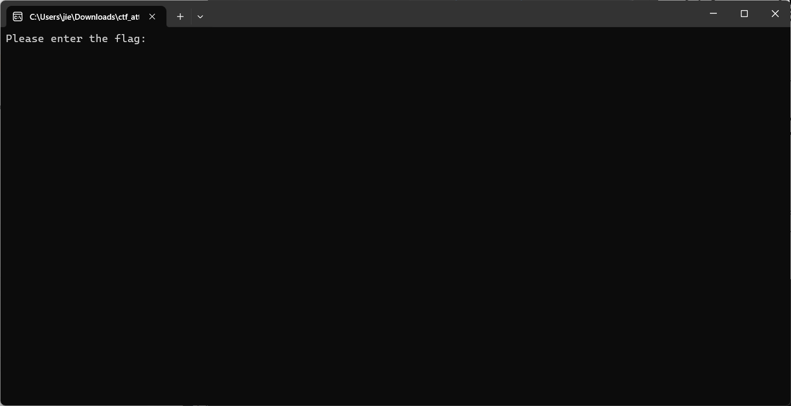
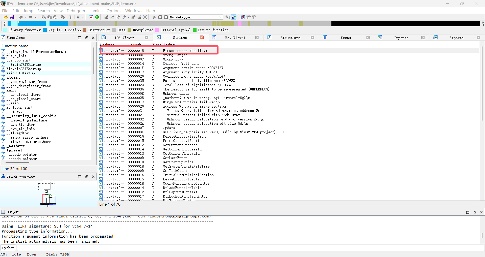
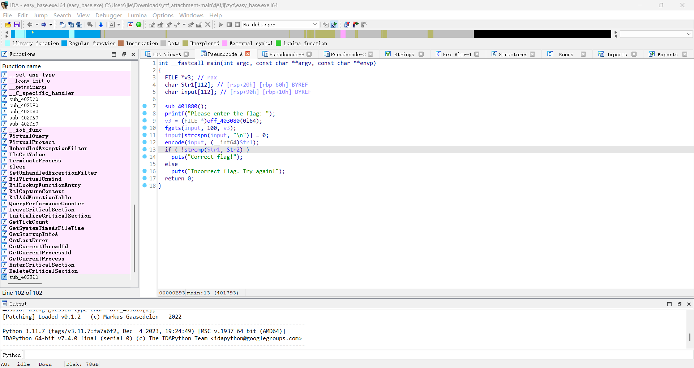
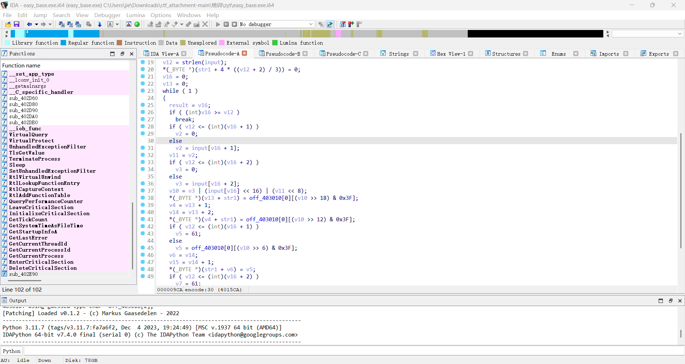
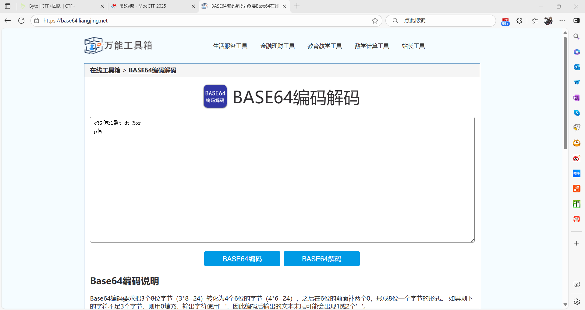

姓名：金振杰
QQ号：2162641503
在为期2天的学习中，我一次学习了以下内容，以下为我的学习报告

# 任务1：python语言的了解
已在高中阶段初步对python有过的系统性学习,并对`base库`进行了了解
1. 打印正三角形
```py
n = int(input("请输入正三角形的高度："))

for i in range(1, n + 1):
    for j in range(n - i):
        print(" ", end="")
    for k in range(2 * i - 1):
        print("*", end="")
    print()
```
2. base64加密脚本
```py
#利用base64库对编码进行加密
import base64
s1 = input().encode()
s2 = base64.b64encode(s1)
print(s2)
#不利用base64库对编码进行加密
base64_chars = "ABCDEFGHIJKLMNOPQRSTUVWXYZabcdefghijklmnopqrstuvwxyz0123456789+/"

def to2(string):
    code = ord(string)
    binary = bin(code)[2:].zfill(8)
    return binary

def twoto10(string):
    decimal = 0
    for bit in string:
        decimal = decimal * 2 + int(bit)
    return decimal

input_str = input("请输入要加密的字符串：")
input_len = len(input_str)
padding = (3 - input_len % 3) % 3
result = []

i = 0
while i < input_len:
    str1 = input_str[i] if i < input_len else '0'
    str2 = input_str[i+1] if i+1 < input_len else '0'
    str3 = input_str[i+2] if i+2 < input_len else '0'
    
    string = to2(str1) + to2(str2) + to2(str3)
    index1 = twoto10(string[0:6])
    index2 = twoto10(string[6:12])
    index3 = twoto10(string[12:18])
    index4 = twoto10(string[18:])

    result.append(base64_chars[index1])
    result.append(base64_chars[index2])
    result.append(base64_chars[index3] if i+1 < input_len else '=')
    result.append(base64_chars[index4] if i+2 < input_len else '=')  
    i += 3
print("Base64加密结果：" + ''.join(result))
```

——————————————————

# 任务2：培训视频
已完成培训视频的观看

——————————————————

# 任务3：IDA的练习

1. 首先打开该exe文件，发现要求输入flag
   
2. 使用IDA对其进行逆向分析，按下`Shift + F12`进入`String`界面，对相应字符串进行搜索
   
   从而找到`main()`函数
   
3. 对`encode()`函数进行分析，发现其结构符合`base64`编码加密过程
   
4. 又经过逆向分析的str2经过解码即为所求flag，经过搜索得str2值为`Y1lHe1czbKQwbXRfZHRfUjVzDXC0fU==`  
在网上利用在线base64解码工具进行解码得到的为乱码
    
5. 重新进行逆向分析发现该加密算法所遵循的编码表并非传统的`base64`编码，而是经过“魔改”，该代码所遵循的编码表为`EFGHIJKLMNOPQRSTUVWXYZABCDabcdefghijklmnopqrstuvwxyz0123456789+/`
6. 于是利用python写出脚本对其进行解码
```py
def custom_base64_decode(encoded_str):
    custom_table = "EFGHIJKLMNOPQRSTUVWXYZABCDabcdefghijklmnopqrstuvwxyz0123456789+/"
    
    char_to_index = {char: idx for idx, char in enumerate(custom_table)}
    
    padding = encoded_str.count('=')
    encoded_str = encoded_str.replace('=', '')
    
    bytes_data = []
    for i in range(0, len(encoded_str), 4):
        group = encoded_str[i:i+4]
        indices = [char_to_index[char] for char in group]
        while len(indices) < 4:
            indices.append(0)
        
        value = (indices[0] << 18) | (indices[1] << 12) | (indices[2] << 6) | indices[3]
        
        byte1 = (value >> 16) & 0xFF
        byte2 = (value >> 8) & 0xFF
        byte3 = value & 0xFF
        
        bytes_data.append(byte1)
        if i + 2 < len(encoded_str):  
            bytes_data.append(byte2)
        if i + 3 < len(encoded_str):  
            bytes_data.append(byte3)
    
    return bytes(bytes_data).decode('utf-8', errors='replace')

if __name__ == "__main__":
    encoded_input = input("请输入使用自定义Base64编码的字符串：")
    decoded_result = custom_base64_decode(encoded_input)
    print(f"解密结果：{decoded_result}")
```
求得flag为`SYC{W3lc0m3_T3_B4se64}`,输入程序后发现答案正确

————————————————————

# 任务4：认识编码
已完成相关任务

——————————————————————

# 任务5：RC4的学习
1. 已在高中阶段对对称加密与非对称加密进行学习  
   对称加密即加密与解密密钥相同的一类加密方法，常见的对称加密算法有`凯撒加密`、`异或加密`、`DES`等等
2. 已在高中阶段学习何为异或  
   异或是一种基础的运算逻辑它的核心规则是：当两个输入的逻辑状态不同时，结果为 `“真”（1）`；当两个输入的逻辑状态相同时，结果为 `“假”（0）`。
3. RC4算法
利用python实现的加解密过程
```py
def ksa(s_box, key):
    j = 0
    key_length = len(key)

    # 扩展密钥：将其重复填充到 256 长度
    key_stream = [ord(key[i % key_length]) for i in range(256)]

    for i in range(256):
        j = (j + s_box[i] + key_stream[i]) % 256
        s_box[i], s_box[j] = s_box[j], s_box[i]
    
    return s_box


def prga(s_box, plaintext):
    i = j = 0
    keystream = []
    ciphertext = []

    for char in plaintext:
        i = (i + 1) % 256
        j = (j + s_box[i]) % 256
        s_box[i], s_box[j] = s_box[j], s_box[i]

        k = s_box[(s_box[i] + s_box[j]) % 256]
        keystream.append(k)

        ciphertext.append(ord(char) ^ k)

    return ciphertext  

# 加密
s_box = list(range(256))
ksa(s_box, "mysecret")
cipher = prga(s_box, "Hello")

# 解密
s_box = list(range(256))
ksa(s_box, "mysecret")
plaintext = prga(s_box, ''.join(chr(c) for c in cipher))
print(''.join(chr(c) for c in plaintext))  # 输出 Hello
```
经过对RC4加密的逆向分析RC4加密通常有一个S盒,属于对称加密  
密钥流的生成与明文无关，仅由初始密钥决定
加密过程通常分为两个阶段:
1. 利用KSA算法进行初始化
2. 利用PRGA算法进行密钥流生成

——————————————————————

# 任务6:线性数据结构
已在高中阶段学习过基础的线性数据结构
以下为通过构造struct实现的链表操作:
```c
#include <stdlib.h>
#include <stdio.h>
#include <string.h>

typedef struct Node {
    int data;
    struct Node* next;
} Node;

//创建新节点
Node* createnewnode(int data) {
    Node* newNode = (Node*)malloc(sizeof(Node));
    newNode->data = data;//将data值存入该新节点
    newNode->next = NULL;//因为是新节点故无下一个节点
    return newNode;
}

//头插
void addtohead(int data, Node** head) {
    Node* newnode = createnewnode(data);//创立新节点作为新的头节点
    newnode->next = *head;
    *head = newnode;
}

//尾插
void addtotail(int data, Node** head) {
    Node* newnode = createnewnode(data);
    
    //检测头节点是否为空节点
    if (*head == NULL) {
        *head = newnode;
        return;
    }

    Node* now = *head;
    while (!(now->next == NULL)) {
        now = now->next;
    }
    now->next = newnode;
}

//指定位置插入
void addtotarget(int data, Node** head, int target) {
    if (target < 1) return;
    if (target == 1) {
        addtohead(data, head);
        return;
    }
    Node* newnode = createnewnode(data);
    if (newnode == NULL) return; 

    int count = 1;
    Node* now = *head;
    while (count < target - 1) {
        if (now == NULL) {
            addtotail(data, head);
            return;
        }
        now = now->next;
        count++;  
    }
    newnode->next = now->next;
    now->next = newnode;
}

//删除指定位置的节点
void deltarget(Node** head, int target) {
    if (*head == NULL) return;
    Node* now = *head;
    Node* pre = NULL;
    int count = 1;
    while (!(target == count)) {
        if (now->next == NULL) return;
        pre = now;
        now = now->next;
        count++;
    }
    if (pre == NULL) *head = now->next;
    else pre->next = now->next;
}

//查找指定值对应的节点
Node* seektarget(int target, Node** head) {
    if (*head == NULL) {
        printf("链表为空，无对应值\n");
        return NULL; 
    }
    Node* now = *head;
    while (now != NULL && now->data != target) {
        now = now->next;  
    }
    return now;
}

int main() {
    Node* head = NULL;
    addtohead(10, &head);
    addtotail(20, &head);
    addtohead(5, &head);
    addtotarget(15, &head, 3);
    addtotarget(25, &head, 5);

    //查找
    Node* found = seektarget(15, &head);
    if (!(found == NULL)) printf("找到节点,位置为%p\n", found);
    else printf("Nothing");

    deltarget(&head, 3);
    Node* now = head;
    while (now != NULL) {
        printf("%d\t", now->data);
        now = now->next;
    }
}
```
以下是通过二维数组实现的链表:
```c
#include <stdio.h>
#include <stdlib.h>

#define MAX_NODES 100  // 最大节点数（二维数组行数）

int list[MAX_NODES][2];  // 二维数组模拟链表：[i][0] = 数据，[i][1] = 下一个节点索引
int head = -1;           // 头节点索引（-1 表示空链表）

// 初始化链表：所有节点标记为未使用（-2）
void initList() {
    for (int i = 0; i < MAX_NODES; i++) {
        list[i][1] = -2;  // -2 表示节点未使用
    }
}

// 查找未使用的节点索引（返回-1表示数组已满）
int findFreeNode() {
    for (int i = 0; i < MAX_NODES; i++) {
        if (list[i][1] == -2) {  // 找到未使用的节点
            return i;
        }
    }
    return -1;  // 数组已满
}

// 创建新节点（返回节点索引，-1表示失败）
int createNode(int data) {
    int idx = findFreeNode();
    if (idx == -1) {
        printf("节点已满，无法创建新节点！\n");
        return -1;
    }
    list[idx][0] = data;    // 存储数据
    list[idx][1] = -1;      // 初始无后继节点（-1 表示NULL）
    return idx;
}

// 插入到链表头部
void insertAtHead(int data) {
    int newIdx = createNode(data);
    if (newIdx == -1) return;

    if (head == -1) {  // 空链表：头节点直接指向新节点
        head = newIdx;
    } else {  // 非空链表：新节点的后继指向原头节点，头节点更新为新节点
        list[newIdx][1] = head;
        head = newIdx;
    }
}

// 插入到链表尾部
void insertAtTail(int data) {
    int newIdx = createNode(data);
    if (newIdx == -1) return;

    if (head == -1) {  // 空链表：头节点直接指向新节点
        head = newIdx;
        return;
    }

    // 遍历到尾部节点（后继为-1的节点）
    int cur = head;
    while (list[cur][1] != -1) {
        cur = list[cur][1];
    }
    list[cur][1] = newIdx;  // 尾部节点的后继指向新节点
}

// 在指定位置插入节点（位置从1开始计数）
void insertAtPos(int data, int pos) {
    if (pos < 1) {
        printf("位置无效（需≥1）！\n");
        return;
    }
    if (pos == 1) {  // 位置1即头部插入
        insertAtHead(data);
        return;
    }

    int newIdx = createNode(data);
    if (newIdx == -1) return;

    // 找到第pos-1个节点（前驱节点）
    int cur = head;
    int prev = -1;
    int count = 1;
    while (count < pos && cur != -1) {
        prev = cur;
        cur = list[cur][1];
        count++;
    }

    if (prev == -1 || count < pos) {  // 位置超出链表长度
        printf("位置超出链表长度！\n");
        list[newIdx][1] = -2;  // 释放新节点（标记为未使用）
        return;
    }

    // 插入新节点：前驱节点的后继指向新节点，新节点的后继指向原前驱的后继
    list[newIdx][1] = list[prev][1];
    list[prev][1] = newIdx;
}

// 删除第一个值为data的节点
void deleteNode(int data) {
    if (head == -1) {
        printf("链表为空，无法删除！\n");
        return;
    }

    int cur = head;
    int prev = -1;

    // 查找值为data的节点及其前驱
    while (cur != -1 && list[cur][0] != data) {
        prev = cur;
        cur = list[cur][1];
    }

    if (cur == -1) {  // 未找到节点
        printf("未找到值为%d的节点！\n", data);
        return;
    }

    // 删除节点：更新前驱节点的后继，释放当前节点（标记为未使用）
    if (prev == -1) {  // 删除头节点
        head = list[cur][1];
    } else {  // 删除非头节点
        list[prev][1] = list[cur][1];
    }
    list[cur][1] = -2;  // 标记为未使用
}

// 查找第一个值为data的节点（返回索引，-1表示未找到）
int findNode(int data) {
    int cur = head;
    while (cur != -1) {
        if (list[cur][0] == data) {
            return cur;  // 找到节点，返回索引
        }
        cur = list[cur][1];
    }
    return -1;  // 未找到
}

// 打印链表
void printList() {
    if (head == -1) {
        printf("链表为空！\n");
        return;
    }

    printf("链表内容（索引:数据）：");
    int cur = head;
    while (cur != -1) {
        printf("%d:%d -> ", cur, list[cur][0]);
        cur = list[cur][1];
    }
    printf("NULL\n");
}

int main() {
    initList();  // 初始化链表

    // 测试插入
    insertAtHead(10);    // 头部插入10
    insertAtTail(20);    // 尾部插入20
    insertAtHead(5);     // 头部插入5（链表：5 -> 10 -> 20）
    insertAtPos(15, 3);  // 位置3插入15（链表：5 -> 10 -> 15 -> 20）
    insertAtPos(25, 5);  // 位置5插入25（链表：5 -> 10 -> 15 -> 20 -> 25）
    printList();

    // 测试查找
    int findIdx = findNode(15);
    if (findIdx != -1) {
        printf("找到值为15的节点，索引为：%d\n", findIdx);
    } else {
        printf("未找到值为15的节点！\n");
    }

    // 测试删除
    deleteNode(10);  // 删除值为10的节点（链表：5 -> 15 -> 20 -> 25）
    printList();

    deleteNode(5);   // 删除头节点（链表：15 -> 20 -> 25）
    printList();

    return 0;
}
```
