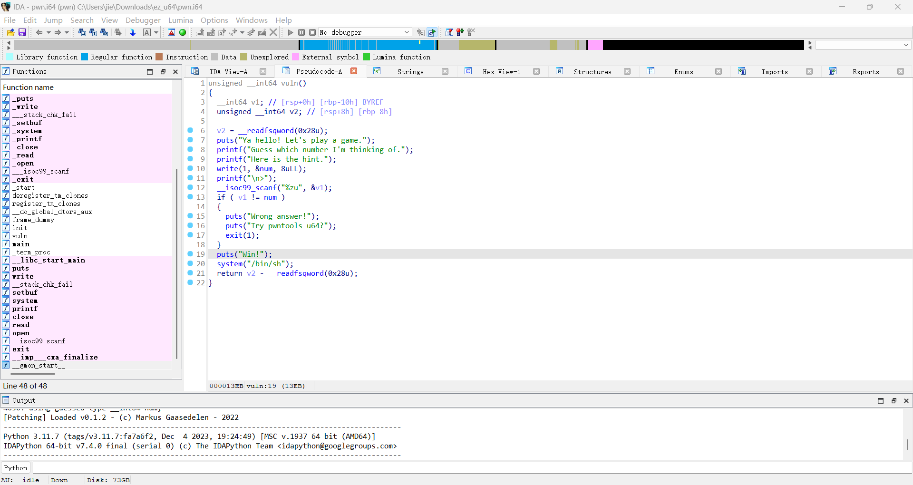
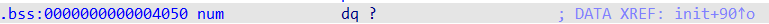
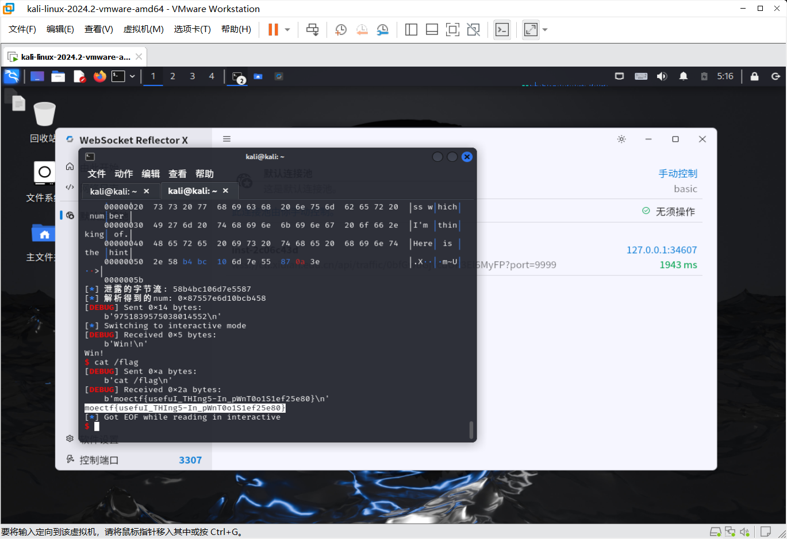

# ez_u64
1. 对该ELF文件逆向分析，获得其`main()`函数
   
2. 对改函数分析得需要向该环境输送`num`的值才能获取flag
3. 双击查看`num`的值，发现无法得知
   
   编写程序获取其`num`值
    ```py
    leaked_bytes = io.recv(8)  

    num = u64(leaked_bytes)
    ```
4. 编写python程序，将该值发送至平台后，程序执行`system("/bin/sh")`提供一个 shell 交互环境,输入`cat /flag`获取flag为`moectf{usefuI_THIng5-In_pWnT0o1S1ef25e80}`
   