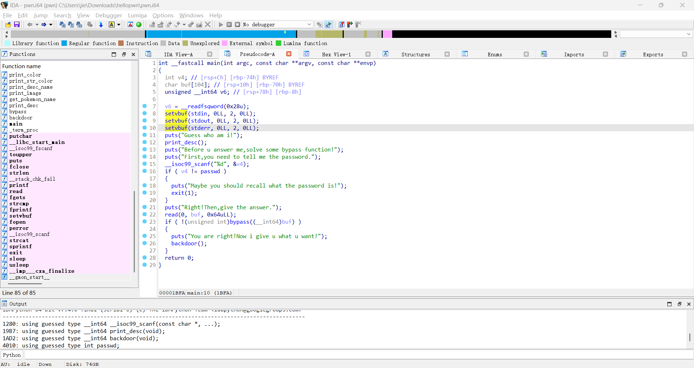
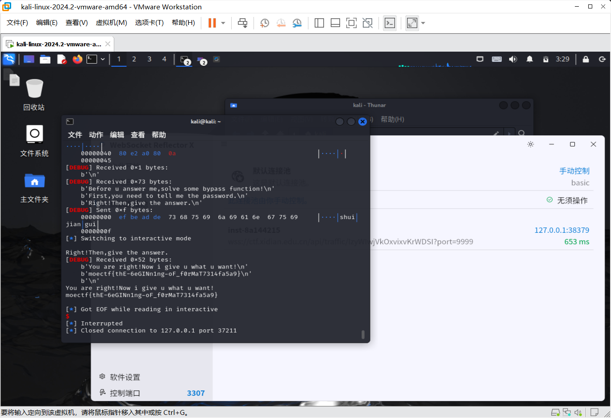

# 二进制漏洞审计入门指北
1. 首先对题目提供的ELF文件逆向分析，找到该文件的`main()`函数
   
2. 对该函数进行分析得需要对该环境传输三个数据，其值分别为`114511` `0xdeadbeef` 和`shijiangui`
3. 编写python代码，是从环境中获取flag
   
   从而获得flag为`moectf{thE-6eGINn1ng-oF_f0rMaT7314fa5a9}`