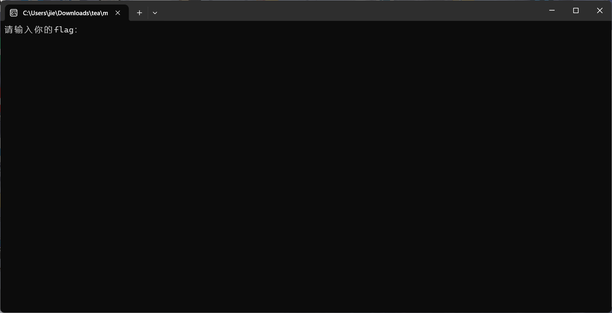
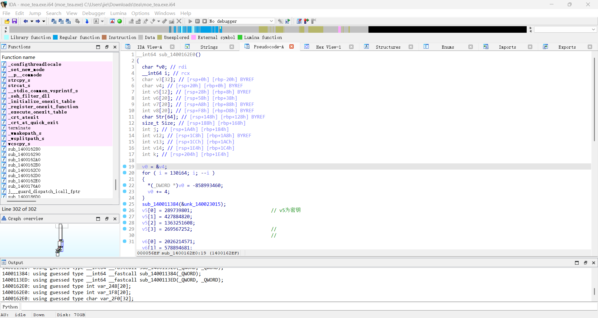
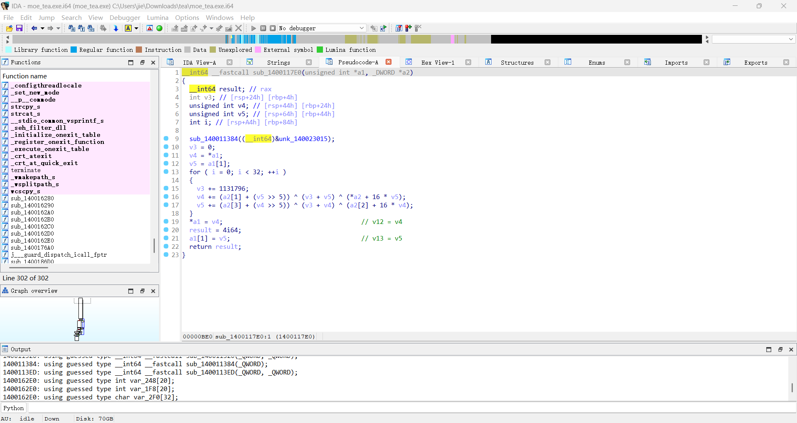

# a cup of tea
1. 首先打开该exe文件，发现要求输入flag
   
2. 使用die套壳工具进行壳的查询，发现没有套壳
3. 使用IDA对其进行逆向分析
   按下Shift + F12对字符串进行查找，从而找到main()函数
   
4. 对函数进行分析，寻找到其加密函数，符合tea加密特征
   
   经过分析与寻找，其中`v6 = [2026214571, 578894681, 1193947460, -229306230, 73202484, 961145356, -881456792, 358205817, -554069347, 119347883]`,`a2 = [289739801, 427884820, 1363251608, 269567252]`
5. 由此写出解密脚本
   ```py
    v6 = [2026214571, 578894681, 1193947460, -229306230, 73202484, 961145356, -881456792, 358205817, -554069347, 119347883]
    a2 = [289739801, 427884820, 1363251608, 269567252]
    result = []

    for i in range(0, len(v6), 2):
        v12 = v6[i]
        v13 = v6[i + 1]
        # 转换为32位无符号整数，匹配C语言unsigned int
        v4 = v12 & 0xFFFFFFFF
        v5 = v13 & 0xFFFFFFFF
        v3 = (1131796 * 32) & 0xFFFFFFFF  # 初始化累加器为无符号值
        
        for j in range(32):
            # 解密运算并保持32位无符号特性
            v5 = (v5 - ((a2[3] + (v4 >> 5)) ^ (v3 + v4) ^ (a2[2] + 16 * v4))) & 0xFFFFFFFF
            v4 = (v4 - ((a2[1] + (v5 >> 5)) ^ (v3 + v5) ^ (a2[0] + 16 * v5))) & 0xFFFFFFFF
            v3 = (v3 - 1131796) & 0xFFFFFFFF  # 累加器递减并保持无符号
        
        result.append(v4)
        result.append(v5)

    # 按小端字节序转换为字符并输出
    decrypted_str = ''
    for val in result:
        # 小端字节序：低位字节在前
        bytes_val = [
            val & 0xFF,
            (val >> 8) & 0xFF,
            (val >> 16) & 0xFF,
            (val >> 24) & 0xFF
        ]
        # 只保留可打印ASCII字符
        for b in bytes_val:
            if 32 <= b <= 126:
                decrypted_str += chr(b)

    print(decrypted_str)
    ```
    解出flag为`moectf{h3r3_4_cuP_0f_734_f0R_y0U!!!!!!}`
6. 代入程序得答案正确