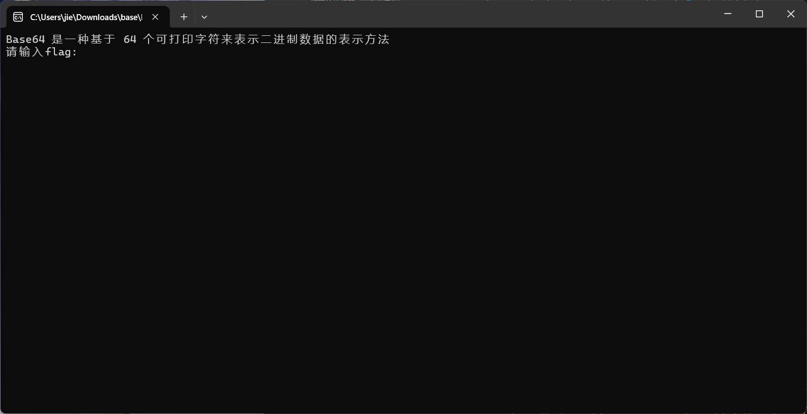
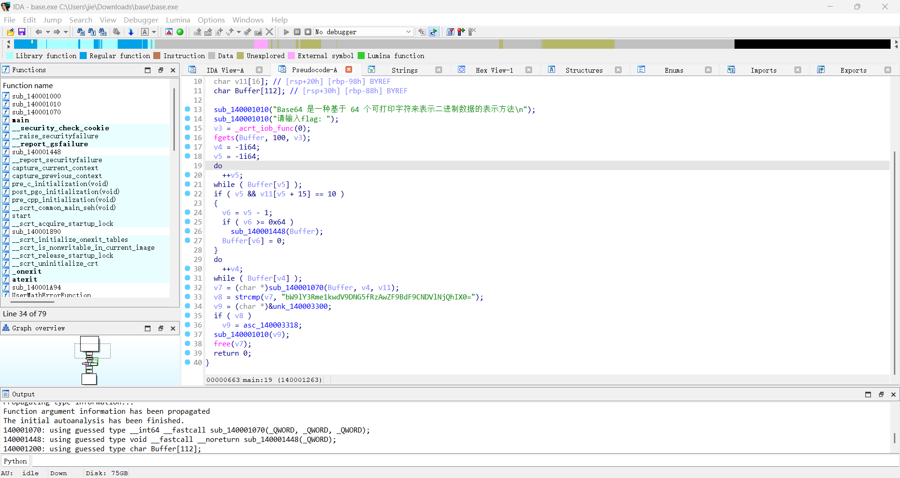

# base
1. 首先打开该exe文件,发现要求输入flag
   
2. 使用DIE查询是否有壳,发现无壳
3. 使用IDA对其进行逆向分析,找到`main()`函数
   
4. 对其加密过程进行分析得,发现符合base64加密,且加密完后的数据为`bW9lY3Rme1kwdV9DNG5fRzAwZF9BdF9CNDVlNjQhIX0=`
5. 对上述数据解密得flag为`moectf{Y0u_C4n_G00d_At_B45e64!!}`