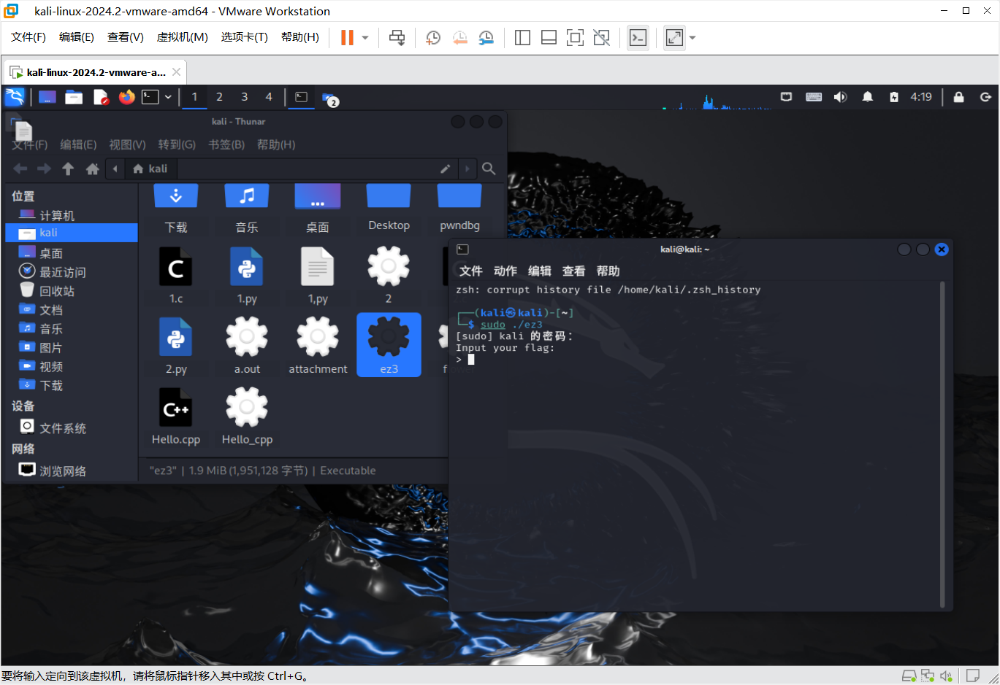
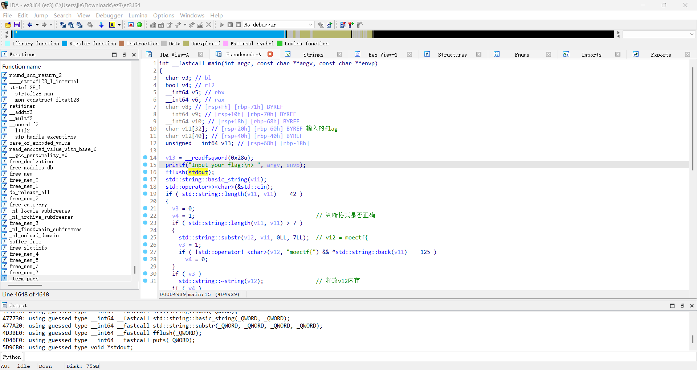
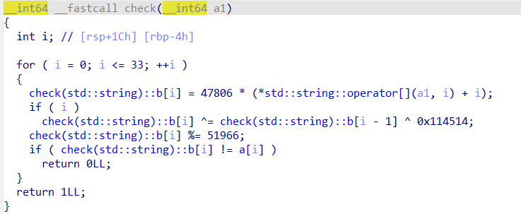

# ez3
1. 在虚拟机中运行该ELF文件发现要求输入flag
   
2. 使用die套壳工具进行壳的查询，发现套用了upx壳，使用`upx -d`指令对文件进行脱壳
3. 使用IDA对其进行逆向分析
   按下Shift + F12对字符串进行查找，从而找到main()函数
   
4. 对main()函数逐步分析，寻找到加密的函数
   
   经分析加密后的数组`a = [0x0B1B0, 0x5678, 0x7FF2, 0x0A332, 0x0A0E8, 0x364C, 0x2BD4, 0x0C8FE, 0x4A7C, 0x18, 0x2BE4, 0x4144, 0x3BA6, 0x0BE8C, 0x8F7E, 0x35F8, 0x61AA, 0x2B4A, 0x6828, 0x0B39E, 0x0B542, 0x33EC, 0x0C7D8, 0x448C, 0x9310, 0x8808, 0x0ADD4, 0x3CC2, 0x796, 0x0C940, 0x4E32, 0x4E2E, 0x924A, 0x5B5C]`
5. 由此写出解密脚本
   ```py
    from z3 import *

    a = [0x0B1B0, 0x5678, 0x7FF2, 0x0A332, 0x0A0E8, 0x364C, 0x2BD4, 0x0C8FE, 
        0x4A7C, 0x18, 0x2BE4, 0x4144, 0x3BA6, 0x0BE8C, 0x8F7E, 0x35F8, 
        0x61AA, 0x2B4A, 0x6828, 0x0B39E, 0x0B542, 0x33EC, 0x0C7D8, 0x448C, 
        0x9310, 0x8808, 0x0ADD4, 0x3CC2, 0x796, 0x0C940, 0x4E32, 0x4E2E, 
        0x924A, 0x5B5C]

    # 初始化求解器
    solver = Solver()

    # 定义34个字符变量，每个字符是8位的位向量
    flag_chars = [BitVec(f'c{i}', 8) for i in range(34)]
    for c in flag_chars:
        # 限制字符为可打印ASCII范围
        solver.add(c >= 32, c <= 126)

    # 定义b数组和异或结果数组
    b = [BitVec(f'b{i}', 32) for i in range(34)]
    xor_results = [BitVec(f'xor{i}', 32) for i in range(34)]

    for i in range(34):
        # 扩展字符和索引为32位
        c_extended = ZeroExt(24, flag_chars[i])
        i_extended = BitVecVal(i, 32)
        
        # 计算基础值：47806 * (字符值 + 索引)
        base = 47806 * (c_extended + i_extended)
        
        # 计算异或结果
        if i > 0:
            solver.add(xor_results[i] == base ^ b[i-1] ^ 0x114514)
        else:
            solver.add(xor_results[i] == base)
        
        # 对异或结果取模，然后赋值给b[i]
        solver.add(b[i] == xor_results[i] % 51966)
        
        # 确保取模结果等于a[i]
        solver.add(b[i] == BitVecVal(a[i], 32))

    if solver.check() == sat:
        model = solver.model()
        flag = ''.join([chr(model[flag_chars[i]].as_long()) for i in range(34)])
        print(flag)
    ```
    由此脚本解得flag内部值为`Y0u_Kn0w_z3_S0Iv3r_N0w_a1f2bdce4a9`
6. 代入所求flag，将其提交发现答案正确
   即所求flag为`moectf{Y0u_Kn0w_z3_S0Iv3r_N0w_a1f2bdce4a9}`