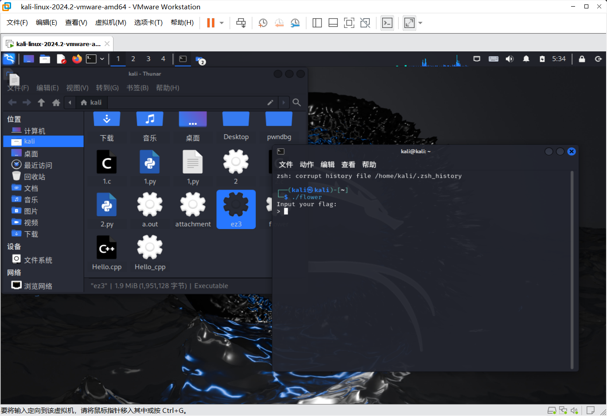
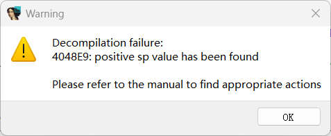
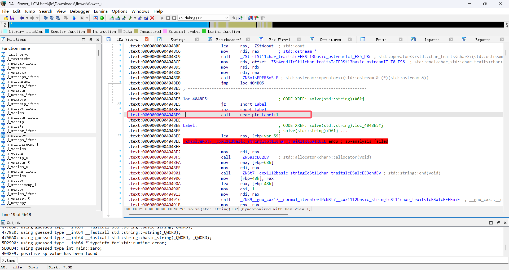
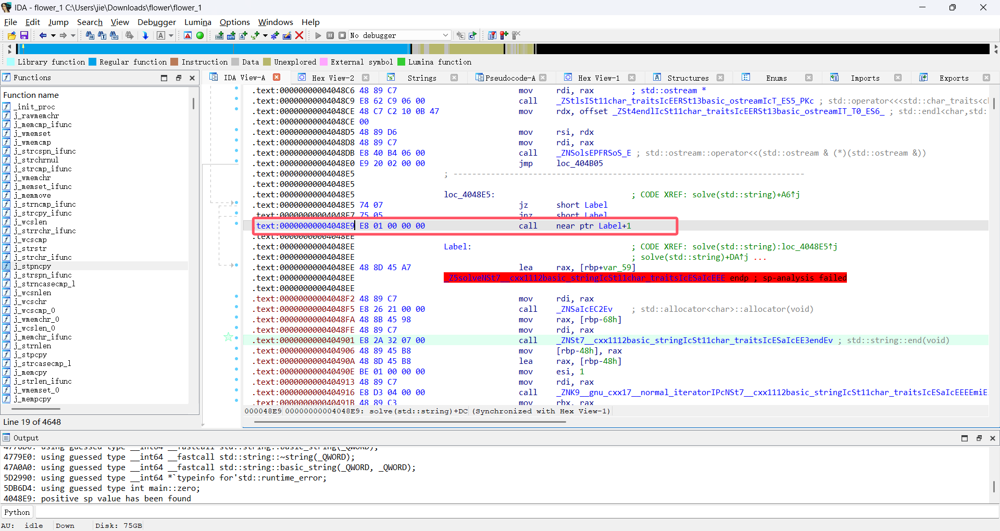
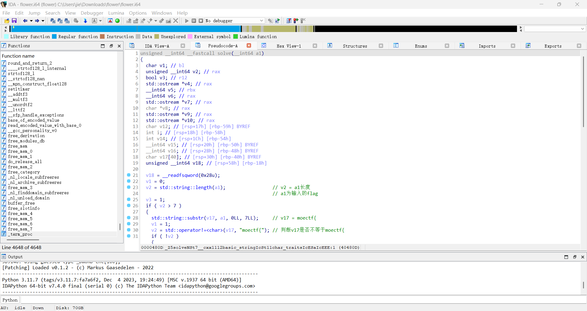
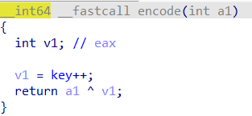

# flower
1. 在虚拟机中运行该ELF文件发现要求输入flag
   
2. 使用die套壳工具进行壳的查询，发现无壳
3. 使用IDA对其进行逆向分析
   在切换反汇编视图与伪代码视图时，发现代码在地址为`4048E9`的地方报错
   
4. 找到该对应地址处，发现出问题的为`call`命令，判断为花指令
   
   查询该处字节码
   
   经过观察发现call的地址为`label + 1`，所以将label的第一个字节码`48`修改成`0x90`，再选中该部分代码按下`C`将其转换为C代码，从而得到正确的代码
   
5. 对代码进行分析，找到加密函数
   
   其中enc为加密过后的flag。其值为`[0x4F, 0x1A, 0x59, 0x1F, 0x5B, 0x1D, 0x5D, 0x6F, 0x7B, 0x47, 0x7E, 0x44, 0x6A, 0x7, 0x59, 0x67, 0x0E, 0x52, 0x8, 0x63, 0x5C, 0x1A, 0x52, 0x1F, 0x20, 0x7B, 0x21, 0x77, 0x70, 0x25, 0x74, 0x2B, 0x44]`
   由此写出解密的python脚本
   ```py
    enc = [0x4F, 0x1A, 0x59, 0x1F, 0x5B, 0x1D, 0x5D, 0x6F, 0x7B, 0x47, 0x7E, 0x44, 0x6A, 0x7, 0x59, 0x67, 0x0E, 0x52, 0x8, 0x63, 0x5C, 0x1A, 0x52, 0x1F, 0x20, 0x7B, 0x21, 0x77, 0x70, 0x25, 0x74, 0x2B, 0x44]
    key = 41  
    result = []

    for i in range(len(enc)):
        a1 = enc[i] ^ key
        result.append(a1)
        
        if 32 <= a1 <= 126:
            char_repr = chr(a1)
        else:
            char_repr = f"[0x{a1:02X}]"
        
        key += 1


    decrypted_str = ''.join([chr(c) if 32 <= c <= 126 else f"[0x{c:02X}]" for c in result])
    print(''.join([chr(c) for c in result if 32 <= c <= 126]))
    ```
    解得flag内部为`f0r3v3r_JuMp_1n_7h3_a$m_a9b35c3c`
6. 将所得提交发现答案正确，即flag为`moectf{f0r3v3r_JuMp_1n_7h3_a$m_a9b35c3c}`