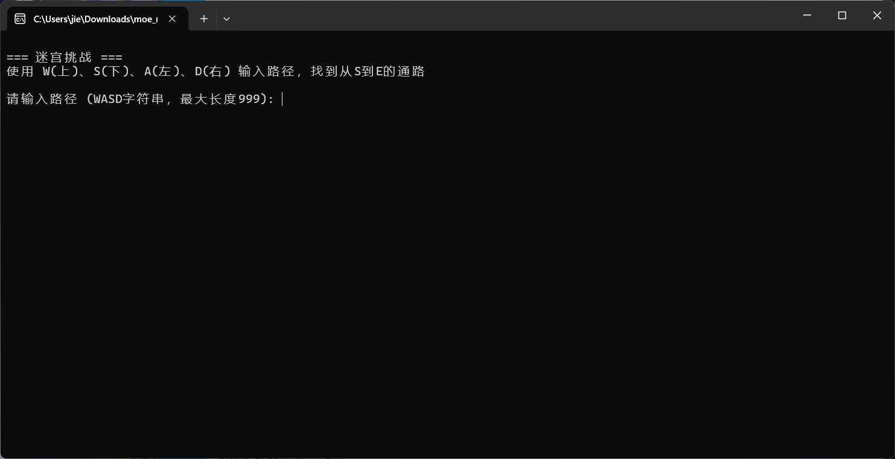
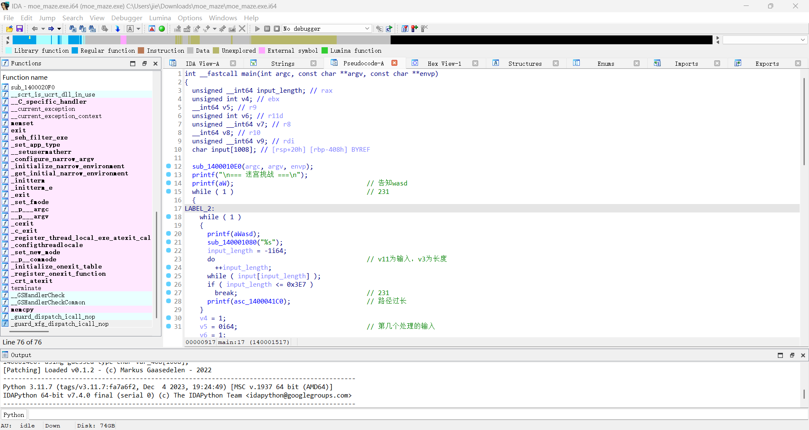

# mazegame
1. 首先打开该exe文件，发现要求输入路径，用wasd表示，即所求的flag为你输入的路径
   
2. 使用IDA对其进行逆向分析
   按下Shift + F12对字符串进行查找，从而找到main()函数
   
   经过分析得，起点为`(1, 1)`，终点为`(14，31)`  
   迷宫为
```py
    maze = [
    # 行0
    "11111111111111111111111111111111111111111111111111111111",
    # 行1
    "1s100000000000000010000011011101011111111101011100000111",
    # 行2
    "10111010111111111010111011000001000001000001000101110111",
    # 行3
    "10000010000010000010001011011111111101110111011101110111",
    # 行4
    "10111111111011101110111011010000000000010100010001110111",
    # 行5
    "10100000001000101000100011010101111111011101110101110111",
    # 行6
    "10101011111110111011101011010101000001000000010101110111",
    # 行7
    "10101010000010100000101011110101110101111101111111110111",
    # 行8
    "10111010111010101111101011100101000100000101000101110111",
    # 行9
    "10000010001010001000001011001111011111010101011101110111",
    # 行10
    "11111011101011111011111111101000100000101100101001110111",
    # 行11
    "10001010001000100010000010001010011000100010010011000001",
    # 行12
    "10111010111110101010111011011001011111010101011101011101",
    # 行13
    "10001010001000001010001011000101000100000101000101011101",
    # 行14
    "11101011101111111011101011110101110111111101110101011101",
    # 行15
    "10001000101000001010001011000100e10100000101000101011101",
    # 行16
    "10111111101011101110111011011111110101110111011101011101",
    # 行17
    "10001000001000100000001011000100000100010000000101011001",
    # 行18
    "11101011111011111111101011110101111101111111110101011011",
    # 行19
    "10101000000010001000101011010100000001000100010101011011",
    # 行20
    "10101111111110101010101011010111111111010101010101011011",
    # 行21
    "10100000000000100010101011010000000000010001010101011011",
    # 行22
    "10111111111111111110111011011111111111111111011101011011",
    # 行23
    "10000000001111000000000011110111010000111100011111011011",
    # 行24
    "11101111100000011011011111111010110111011101100001011011",
    # 行25
    "11101111111111111011011111111101110111101101100001011011",
    # 行26
    "10001000111111000010000011111010110111011101100001011011",
    # 行27
    "10111010111111111010111011110111010000111101100001010011",
    # 行28
    "10000010000010000010001011111111111111111101100001010111",
    # 行29
    "10111111111011101110111011110001000110001101100001010001",
    # 行30
    "10100000001000101000100011110111011101111101100001011101",
    # 行31
    "10101011111110111011101011110001000101111101100001011101",
    # 行32
    "10101010000010100000101011111101011101111101100001011101",
    # 行33
    "10111010111010101111101011110001000110001101100001011101",
    # 行34
    "10000010001010101000001011111111111111111101100001011101",
    # 行35
    "11111011101011111011111110000000000000001101100001011101",
    # 行36
    "10001010001000100010000011111111111111111100110011011101",
    # 行37
    "10111010111110101010111010010000000011111110001111011101",
    # 行38
    "10001010001000001010001010110111000001111110100101011101",
    # 行39
    "11101011101111111011101000110011001111111100110111011101",
    # 行40
    "10001000101000001010001011111111111111111111110111010001",
    # 行41
    "10111111101011101110111010100001001100000000000011011011",
    # 行42
    "10001000001000100000001011111111111101011101111001011011",
    # 行43
    "10101011111011111111101011000000000001000100010111011011",
    # 行44
    "10101000000010001000101010010111111111111111111111011011",
    # 行45
    "10101111111110101010101010110111111111111111111101011011",
    # 行46
    "10100000000000100010101011100000000000000000000011011011",
    # 行47
    "10111111111111111110011011111111111111111111111011011011",
    # 行48
    "10000011111111111111000010000000000000000000000000011001",
    # 行49
    "11111011111111111111111111111111111111111111111111111101",
    # 行50
    "11111011100001100110110111000000000000000000000111111101",
    # 行51
    "11111011101111011010000111011111111111111111110111111101",
    # 行52
    "11111011100001000010110110000111111111111111110000000001",
    # 行53
    "11111011101111011010110111101111111111111111111111111111",
    # 行54
    "11110000000000011000110000000000000000000000000000000011",
    "11111111111111111111111111111111111111111111111111111111"
]
```
3. 由此写出走迷宫代码
   ```py
    maze = [
        # 行0
        "11111111111111111111111111111111111111111111111111111111",
        # 行1
        "1s100000000000000010000011011101011111111101011100000111",
        # 行2
        "10111010111111111010111011000001000001000001000101110111",
        # 行3
        "10000010000010000010001011011111111101110111011101110111",
        # 行4
        "10111111111011101110111011010000000000010100010001110111",
        # 行5
        "10100000001000101000100011010101111111011101110101110111",
        # 行6
        "10101011111110111011101011010101000001000000010101110111",
        # 行7
        "10101010000010100000101011110101110101111101111111110111",
        # 行8
        "10111010111010101111101011100101000100000101000101110111",
        # 行9
        "10000010001010001000001011001111011111010101011101110111",
        # 行10
        "11111011101011111011111111101000100000101100101001110111",
        # 行11
        "10001010001000100010000010001010011000100010010011000001",
        # 行12
        "10111010111110101010111011011001011111010101011101011101",
        # 行13
        "10001010001000001010001011000101000100000101000101011101",
        # 行14
        "11101011101111111011101011110101110111111101110101011101",
        # 行15
        "10001000101000001010001011000100e10100000101000101011101",
        # 行16
        "10111111101011101110111011011111110101110111011101011101",
        # 行17
        "10001000001000100000001011000100000100010000000101011001",
        # 行18
        "11101011111011111111101011110101111101111111110101011011",
        # 行19
        "10101000000010001000101011010100000001000100010101011011",
        # 行20
        "10101111111110101010101011010111111111010101010101011011",
        # 行21
        "10100000000000100010101011010000000000010001010101011011",
        # 行22
        "10111111111111111110111011011111111111111111011101011011",
        # 行23
        "10000000001111000000000011110111010000111100011111011011",
        # 行24
        "11101111100000011011011111111010110111011101100001011011",
        # 行25
        "11101111111111111011011111111101110111101101100001011011",
        # 行26
        "10001000111111000010000011111010110111011101100001011011",
        # 行27
        "10111010111111111010111011110111010000111101100001010011",
        # 行28
        "10000010000010000010001011111111111111111101100001010111",
        # 行29
        "10111111111011101110111011110001000110001101100001010001",
        # 行30
        "10100000001000101000100011110111011101111101100001011101",
        # 行31
        "10101011111110111011101011110001000101111101100001011101",
        # 行32
        "10101010000010100000101011111101011101111101100001011101",
        # 行33
        "10111010111010101111101011110001000110001101100001011101",
        # 行34
        "10000010001010101000001011111111111111111101100001011101",
        # 行35
        "11111011101011111011111110000000000000001101100001011101",
        # 行36
        "10001010001000100010000011111111111111111100110011011101",
        # 行37
        "10111010111110101010111010010000000011111110001111011101",
        # 行38
        "10001010001000001010001010110111000001111110100101011101",
        # 行39
        "11101011101111111011101000110011001111111100110111011101",
        # 行40
        "10001000101000001010001011111111111111111111110111010001",
        # 行41
        "10111111101011101110111010100001001100000000000011011011",
        # 行42
        "10001000001000100000001011111111111101011101111001011011",
        # 行43
        "10101011111011111111101011000000000001000100010111011011",
        # 行44
        "10101000000010001000101010010111111111111111111111011011",
        # 行45
        "10101111111110101010101010110111111111111111111101011011",
        # 行46
        "10100000000000100010101011100000000000000000000011011011",
        # 行47
        "10111111111111111110011011111111111111111111111011011011",
        # 行48
        "10000011111111111111000010000000000000000000000000011001",
        # 行49
        "11111011111111111111111111111111111111111111111111111101",
        # 行50
        "11111011100001100110110111000000000000000000000111111101",
        # 行51
        "11111011101111011010000111011111111111111111110111111101",
        # 行52
        "11111011100001000010110110000111111111111111110000000001",
        # 行53
        "11111011101111011010110111101111111111111111111111111111",
        # 行54
        "11110000000000011000110000000000000000000000000000000011",
        "11111111111111111111111111111111111111111111111111111111"
    ]

    from collections import deque

    def find_shortest_path(maze):
        start = None
        end = None
        rows = len(maze)
        cols = len(maze[0]) if rows > 0 else 0
        
        for y in range(rows):
            for x in range(cols):
                if maze[y][x] == 's':
                    start = (x, y)
                elif maze[y][x] == 'e':
                    end = (x, y)
        
        if not start:
            return "未找到起点's'"
        if not end:
            return "未找到终点'e'"
        

        directions = [(0, -1, 'w'), (0, 1, 's'), (-1, 0, 'a'), (1, 0, 'd')]
        visited = set() 
        queue = deque()  
        queue.append((start[0], start[1], ""))
        visited.add((start[0], start[1]))
        
        while queue:
            x, y, path = queue.popleft()
            
            
            if (x, y) == end:
                return path
            
        
            for dx, dy, dir in directions:
                nx = x + dx  
                ny = y + dy  
                if 0 <= nx < cols and 0 <= ny < rows:
                    if (maze[ny][nx] in ('0', 'e')) and (nx, ny) not in visited:
                        visited.add((nx, ny))
                        queue.append((nx, ny, path + dir))
        
        return "无有效路径从起点到终点"

    result = find_shortest_path(maze)
    print(f"\n最短路径: {result}")
    ```
    求得最短路径为`ssddddwwddssddddssddssssddwwddwwddwwwwddddssssaassssaaaassaassaawwaawwwwaaaassddssaassddssssaaaassddddddwwwwddddssddddwwddwwaawwddddssssssssssssaaasssdddssssaassssaaaassaassaawwaawwwwaaaassddssaassddssssaaaassddddddwwwwddddssddddwwddwwaawwddddssssssssssssaaawawwwaassaawwaassaaaaaaaaaawwwwaassssssddddssssssdddddddddwwdddssddwwwdddsssdddddwwawwddddddddddddddddddddssddddddddwwwwawwwwwwwwdwwwwwwwwwwwaawwdwwwwwwwwwwdwwwwwwaaaasssssssssssssssssssssssssssssssssssssaaawwaaaaaaaaaaaaaaaaaaawwwddddddddwwddddddddddwwwawaawawwwwwwwwwwwwwddwwwwaassaawwaassaaaaaaaaaawwwwaawwddwwaawwdwwwdwwwwddddddddddssddddssssdsdssddssaassaaaawwaaaassssaaaaaawwddddwwwwaawwawaassdsssdd`
4. 将路径输入exe文件，最终求得flag为`moectf{ssddddwwddssddddssddssssddwwddwwddwwwwddddssssaassssaaaassaassaawwaawwwwaaaassddssaassddssssaaaassddddddwwwwddddssddddwwddwwaawwddddssssssssssssaaasssdddssssaassssaaaassaassaawwaawwwwaaaassddssaassddssssaaaassddddddwwwwddddssddddwwddwwaawwddddssssssssssssaaawawwwaassaawwaassaaaaaaaaaawwwwaassssssddddssssssdddddddddwwdddssddwwwdddsssdddddwwawwddddddddddddddddddddssddddddddwwwwawwwwwwwwdwwwwwwwwwwwaawwdwwwwwwwwwwdwwwwwwaaaasssssssssssssssssssssssssssssssssssssaaawwaaaaaaaaaaaaaaaaaaawwwddddddddwwddddddddddwwwawaawawwwwwwwwwwwwwddwwwwaassaawwaassaaaaaaaaaawwwwaawwddwwaawwdwwwdwwwwddddddddddssddddssssdsdssddssaassaaaawwaaaassssaaaaaawwddddwwwwaawwawaassdsssdd}`
