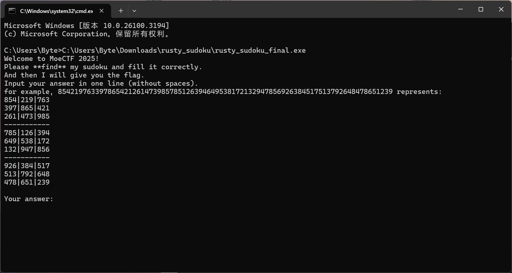
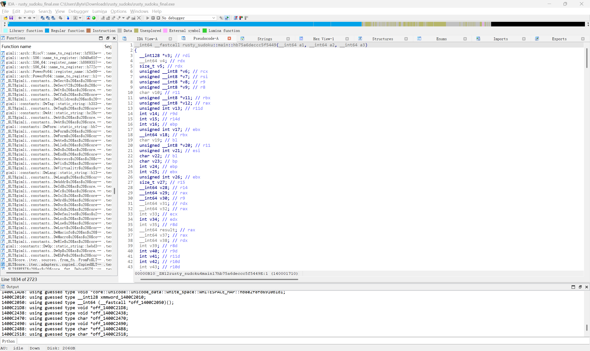
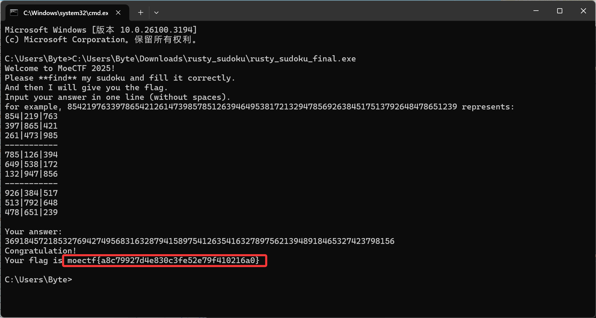

# rusty_sudoku
1. 使用DIE查询是否套壳，发现无壳
2. 运行该exe文件，发现要求解数独
    
3. 使用IDA逆向该exe文件，找到`main()`函数  
    
4. 寻找数独，发现为`.6..8..7.18.3......7.9....1...8...15.9..4.2..54...2..9.....3948.....5..7..3....5.`<br>
   编写解数独的python脚本
    ```py
    def is_valid(board, row, col, num):
        for i in range(9):
            if board[row][i] == num:
                return False
        
        for i in range(9):
            if board[i][col] == num:
                return False
        
        start_row, start_col = 3 * (row // 3), 3 * (col // 3)
        for i in range(start_row, start_row + 3):
            for j in range(start_col, start_col + 3):
                if board[i][j] == num:
                    return False
        
        return True

    def solve(board):
        for row in range(9):
            for col in range(9):
                if board[row][col] == '.':  
                    for num in '123456789':  
                        if is_valid(board, row, col, num):
                            board[row][col] = num
                            if solve(board): 
                                return True
                            board[row][col] = '.' 
                    return False  
        return True  

    def print_board(board):
        for row in board:
            print(' '.join(row))

    def format_input(input_str):
        return [list(input_str[i:i+9]) for i in range(0, len(input_str), 9)]

    input_str = ".6..8..7.18.3......7.9....1...8...15.9..4.2..54...2..9.....3948.....5..7..3....5."

    board = format_input(input_str)

    solve(board)

    print_board(board)
    ```
5. 将解出来的数独输入程序获得flag为`moectf{a8c79927d4e830c3fe52e79f410216a0}`
   