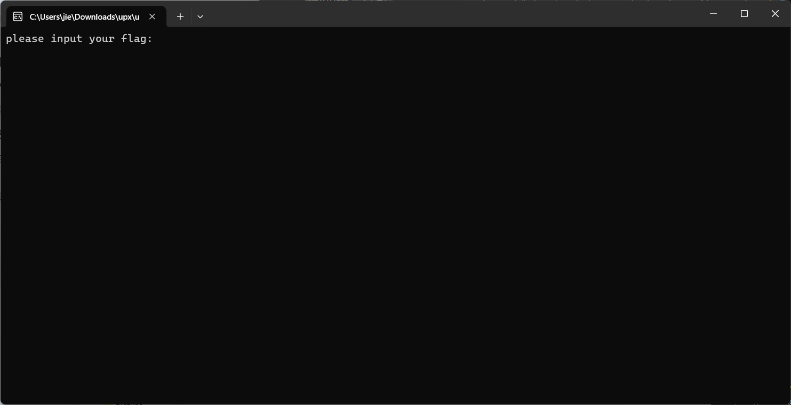
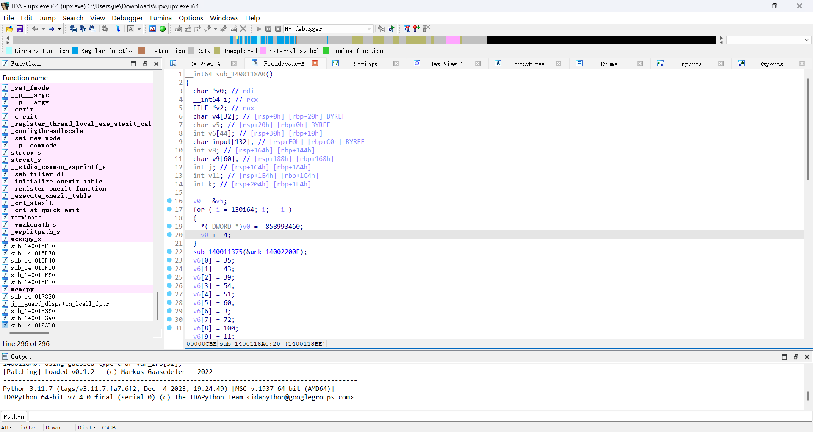
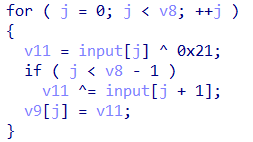

# upx
1. 首先打开该exe文件，发现要求输入flag
   
2. 使用die套壳工具进行壳的查询，发现套用了upx壳，使用`upx -d`指令对文件进行脱壳
3. 使用IDA对其进行逆向分析
   按下Shift + F12对字符串进行查找，从而找到main()函数
   
4. 对函数进行分析发现
   `v6 = [35, 43, 39, 54, 51, 60, 3, 72, 100, 11, 29, 118, 123, 16, 11, 58, 63, 101, 118, 41, 21, 55, 28, 10, 8, 33, 62, 60, 61, 22, 11, 36, 41, 36, 86]`
   所求的flag为v6经过解密所获得的内容,其中加密过程为
   
5. 利用python写出解密脚本
    ```py
    a = [35, 43, 39, 54, 51, 60, 3, 72, 100, 11, 29, 118, 123, 16, 11, 58, 63, 101, 118, 41, 21, 55, 28, 10, 8, 33, 62, 60, 61, 22, 11, 36, 41, 36, 86]

    v8 = len(a)
    input_bytes = [0] * v8

    # 最后一位直接解
    input_bytes[-1] = a[-1] ^ 0x21 ^ 0xA

    # 从倒数第二位开始逆推
    for j in range(v8 - 2, -1, -1):
        input_bytes[j] = (a[j] ^ input_bytes[j + 1]) ^ 0x21

    # 转换成字符串（假设原始是ASCII）
    decoded_str = ''.join(chr(x) for x in input_bytes)
    print(decoded_str)
    ```
    注意到因为使用fgets()函数会读入`"\n"`换行符，其ASCII码为`0x0A`，故`input_bytes[-1] = a[-1] ^ 0x21 ^ 0xA`需要再与`0x0A`进行异或计算
6. 最终求得flag为`moectf{Y0u_c4n_unp4ck_It_vvith_upx}`，提交发现flag正确