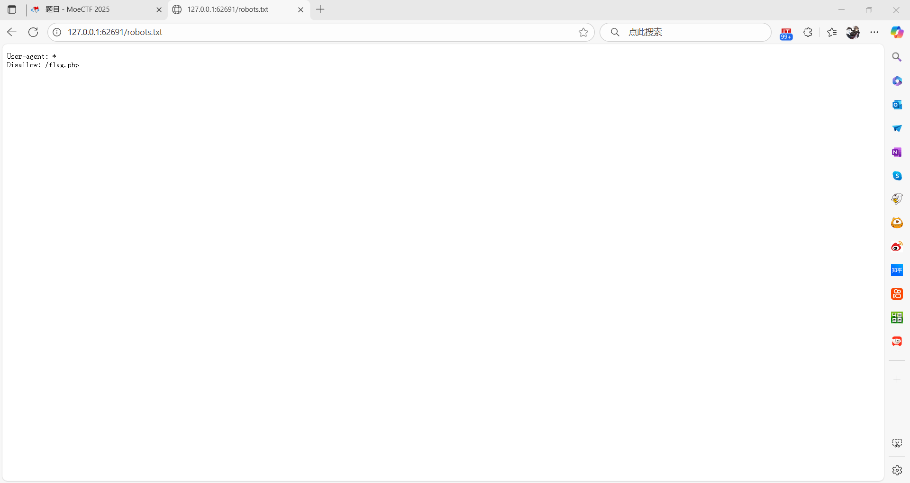

# 第七章 灵蛛探穴与阴阳双生符
1. 首先打开对应靶场的网址,根据题目提示进入`robots.txt`
   
   发现告知爬虫禁止访问`/flag.php`,由此判断flag在`/flag.php`页面内
2. 进入该页面,发现一段PHP代码
    ```php
    <?php
    highlight_file(__FILE__);
    $flag = getenv('FLAG');

    $a = $_GET["a"] ?? "";
    $b = $_GET["b"] ?? "";

    if($a == $b){
        die("error 1");
    }

    if(md5($a) != md5($b)){
        die("error 2");
    }

    echo $flag; error 1
    ```
    因此判断向网页传输`a`与`b`的值由此可以获得flag
3. 经过分析得,两个变量必须满足`$a != $b`与`md5($a) == md5($b)`,方可得到flag
4. 首先传输的a与b变量的值不能相等  
   其次,二者的md5哈希值必须相等,由于使用的是==（非严格比较），PHP 会尝试将比较的双方转换为相同类型后再比较。如果字符串以0e开头，且后面跟随的字符全部是数字，PHP 会将其识别为科学计数法表示的 0  
   因此传输一段哈希值都以0e开头，且后续均为数字的`a` `b`值,即可获得flag
5.最终得到flag为`moectf{MdS-1S_n0T-sAFel!21ed4a54456}`